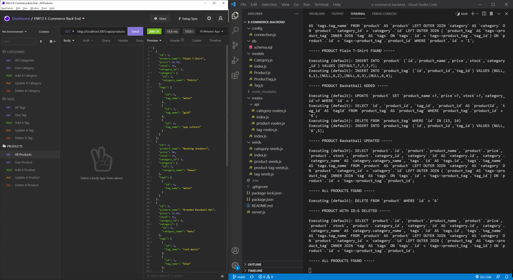

# E-Commerce Backend

## Description

The purpose of this project was to configure a working Express.js API backend to use Sequelize to query the MySQL database of products, tags, and categories for an E-commerce storefront. Four sequelize models were created for the database, Category, Product, Tag, and ProductTag which handles the many to many relationship between products and tags. I developed the CRUD functionality for the different express routes which included GET all data, Get one, POST, PUT, and DELETE processes for all three sequelize models. To test that these routes were working before deployment to a live site I used Insomnia to return the JSON objects. A demonstration of these routes can be seen in the walkthrough video below. 



## User Story/Goal

```
AS A manager at an internet retail company
I WANT a back end for my e-commerce website that uses the latest technologies
SO THAT my company can compete with other e-commerce companies
```

## Walkthrough Video

https://www.youtube.com/watch?v=5UCJi-xWong&ab_channel=WilliamCrownover

## Installation/Dependencies

You will need Node.js installed on your local machine to run this app.
Then you can clone this repo to your local machine.
You can then run it in VSCode and open an integrated terminal of the root folder.
Before use, run `npm install` to load any dependencies.

In the root folder create a ‘.env’ file and paste these lines of code changing password to your MySQL root user password.
```
DB_USER=root
DB_PW=password
DB_NAME=ecommerce_db
```
To setup the initial database login to the MySQL shell using `mysql -u root -p` and then run the schema file with `source db/schema.sql`.

You may use the seeds folder to populate example tables to the database using `npm run seed`.

## Usage

After proper installation, the app can be run using `npm start` in the command line.

To test that the server is working you can use a program like Insomnia or Postman to make GET, POST, PUT, and DELETE requests for the three models, Category, Product, and Tag. See the walkthrough video for a demonstration of these routes.

## Technologies

- Node.js
- Express.js
- MySQL2
- Sequelize
- Dotenv 
